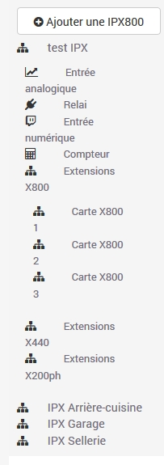

Presentation 
============

This plugin allows you to manage GCE IPX800 cards.
Initially, this plugin was created to connect GCE IPX800s.

Data visible on the Dashboard : 
-----------------------------------

-   ''analog inputs''

-   ''digital inputs''

-   ''the relays''

-   ''pulse counters''

Installation / Setup 
========================

We will now configure a device. To do so, click
on '' Plugins / Home automation protocol / IPX800''

Then click on the button at the top left '' Add equipment''

Then enter the name of the equipment (ex. IPX 1).

Then define :

-   ''Parent object''

-   ''Category '' (optional)

-   ''Activate '' (check, otherwise the equipment will not be usable)

-   ''Visible '' (optional if you don't want to make it visible on
    the Dashboard)

-   ''IP adress''

-   ''Port''

-   ''Compte''

-   ''Password''

Refresh rate 
-----------------------------

For analog inputs and counters, the data is
retrieved by the plugin every minute. It is not possible
to have a higher frequency. For the rest, if the push mode is
activated, refresh is almost instantaneous.

To activate the push, click on

Then go down and click on Apply.

Behavior with the mobile application 
--------------------------------------

By default, here is the behavior :

-   ''L'ip800''

The commands are all configured.

-   ''analog inputs''

The commands are all visible by default and the type depends on the
chosen probe.

-   ''digital inputs''

Orders are considered lights.

-   ''the relays''

Orders are considered lights.

-   ''pulse counters''

Orders are considered generic types.

It should be noted that we will find in the application the commands to
from the moment they are configured, even if they are not
marked as visible. To hide them, you must choose in
"Command configuration "⇒" Generic type "⇒" Disregard
this order".

Some screenshots 
=======================

