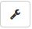
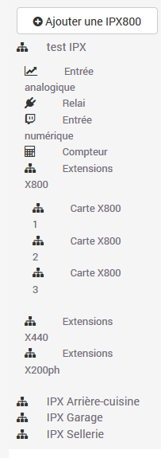
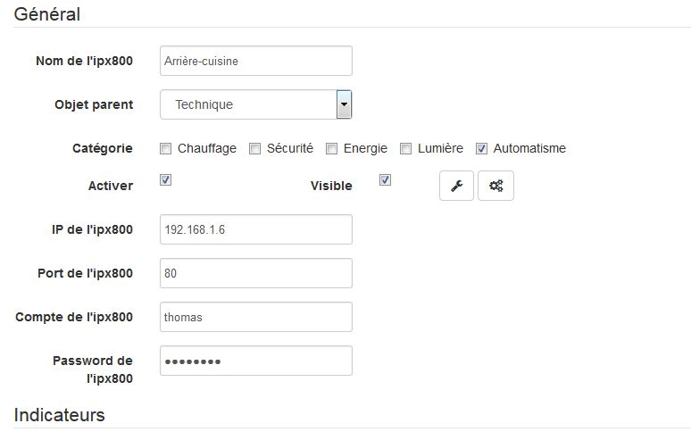
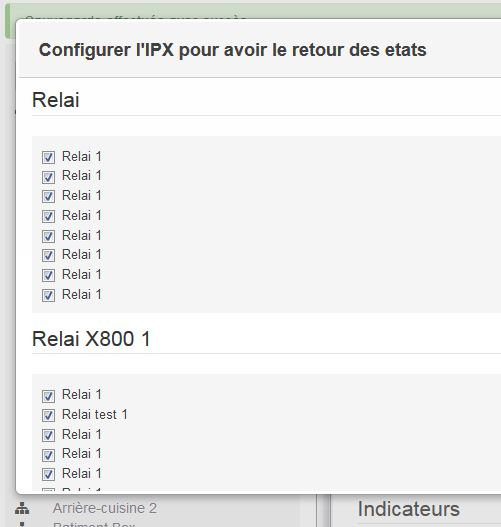
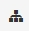

Présentation 
============

Ce plugin permet de gérer les cartes IPX800 de GCE.

Initialement, ce plugin a été créé pour connecter les IPX800 de GCE.

Données visibles sur le Dashboard : 
-----------------------------------

-   ''les entrées analogiques''

-   ''les entrées numeriques''

-   ''les relais''

-   ''les compteurs d’impulsions''

Installation/Paramétrage 
========================

Nous allons maintenant paramétrer un équipement. Pour se faire, cliquer
sur ''Plugins / Protocole domotique / IPX800''

Puis cliquer sur le bouton en haut à gauche ''Ajouter un équipement''

Puis saisir le nom de l’équipement (ex. IPX 1).

Puis définir :

-   ''Objet parent''

-   ''Catégorie'' (optionnelle)

-   ''Activer'' (à cocher, sinon l’équipement ne sera pas utilisable)

-   ''Visible'' (optionel si vous ne désirez pas le rendre visible sur
    le Dashboard)

-   ''Adresse IP''

-   ''Port''

-   ''Compte''

-   ''Mot de passe''

Fréquence de rafraichissement 
-----------------------------

Pour les entrées analogiques et les compteurs, les données sont
récupérées par le plugin toutes les minutes. Il n’est pas possible
d’avoir une fréquence plus élevée. Pour le reste, si le mode push est
activé, le rafraichissement est quasi instantané.

Pour activer le push, il faut cliquer sur

Ensuite aller en bas et cliquer sur Appliquer.

Comportement avec l’application mobile 
--------------------------------------

Par defaut, voici le comportement :

-   ''L’ip800''

Les commandes sont toutes paramétrées.

-   ''les entrées analogiques''

Les commandes sont toutes par defaut visible et le type dépend de la
sonde choisi.

-   ''les entrées numeriques''

Les commandes sont considérées comme des lumières.

-   ''les relais''

Les commandes sont considérées comme des lumières.

-   ''les compteurs d’impulsions''

Les commandes sont considérées comme des types génériques.

Il faut noter que l’on retrouvera dans l’application les commandes à
partir du moment où elles sont paramétrées, même si elles ne sont pas
marquées comme visible. Pour les masquer, il faut choisir dans
"Configuration commande" ⇒ "Type générique" ⇒ "Ne pas tenir compte de
cette commande".

Quelques copies d’écran 
=======================

FAQ 
===

Il faut dans le menu gauche cliquer sur l’icône suivant pour y avoir
accès : 

Oui il suffit de suivre ce qui est écrit [là](#config_push).

Les données sont mises à jour en permanence pour les entrées numériques
et les relais. Elles sont mises à jour une fois par minutes pour les
entrées analogiques et les compteurs.

Il est nécessaire au préalable d’activer temporairement le debug de
Jeedom (menu Configuration ⇒ Configuration des logs & messages ⇒ Activer
+ Niveau de log = Debug).

Ce plugin est gratuit pour que chacun puisse en profiter simplement. Si
vous souhaitez tout de même faire un don au développeur du plugin, merci
de me faire un MP sur le forum.

C’est tout à fait possible via
[github](https://github.com/guenneguezt/plugin-ipx800)

Change log 
==========

> **Warning**
>
> Detail complet des mises à jour sur [Historique
> Commit](https://github.com/guenneguezt/plugin-ipx800/commits/master)

Liste des évolutions majeures de la version courante :

-   Suppression du lien Paypal pour être conforme avec Jeedom V3.1

Anciennes évolutions :

-   Ajout de configuration push pour entrée analogique

-   Ajout d’une Clef API specifique au plugin

-   Modification pour compatibilité Jeedom V3

-   Plus de suivi de version

-   Correction du nombre d’entrée pour l’extention X800-2

-   Prise en compte des sondes CT100A et ORP Probe.

-   Continue la collecte lorsque une IPX est HS.

-   Trappe certains messages d’erreur.

-   Ajout du type LIGHT\_TOGGL pour les relais.

-   Définition template des relais boutons.

-   Modification être compatible avec le plugin mobile.

-   Mise a jour des entrées analogiques, même si la valeur ne change pas
    pour les graphiques.

-   Compatibilité Jeedom 2.0.

-   Modification de cron pour plus d’autonomie.

-   Modification de l’extension du logo.

-   Compatibilité Imperihome.

-   Retrait de la suppression des équipements lors de la désactivation
    du plugin.

-   Correction par rapport au nouveau core.

-   Correction des formules pour les pinces ampèremetriques.

-   Message de debug pour les receptions de push.

-   Prise en compte du port pour jeedom et de l’IP sans qu’il soit
    nécessaire que ce soit renseigné au niveau globale.

-   Correction des fréquences d’impulsion par minute.

-   Message de debug pour les calculs d’impulsion/minute.

-   Supression de l’info `updatetime`.

-   Ajout des pinces 50A.

-   Ajout de Correction automatique par rapport au seuil Min et Max.

-   Ajout de lien vers les options d’affichage.

-   Correction de double cron.

-   Prise en charge des compteurs indépendament des boutons.

-   Ajout du nombre d’impulsions par minute.

-   Ajout d’une information status.

-   Redéclenchement jusqu’à 3 fois en cas d’indispo de l’IPX.

-   Prise en compte des extensions x800 et x400.

-   Correction pour la réception des push pour les entrées numériques.

-   Prise en compte des unitées pour les entrées analogiques.

-   Correction de la cron pour ne prendre que les changements d’état.

-   Possibilité de configurer le push que sur certaines entrées.

-   Ajout des formules pour les entrée analogiques.

-   Ajout `all on` et `all off`.

